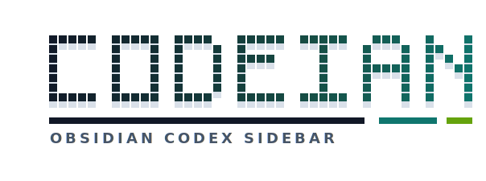

<div align="center">

  <picture>
    <source media="(prefers-color-scheme: dark)" srcset=".github/logo-dark.svg">
    <source media="(prefers-color-scheme: light)" srcset=".github/logo-light.svg">
    
  </picture>

  <p>Codex in your Obsidian sidebar, with your vault as the working context.</p>
</div>

Use Codex from a sidebar in your vault.

Codeian is a desktop-only Obsidian plugin that embeds a Codex prompt surface inside your vault. It is built for users who want to ask Codex for help while staying in Obsidian, with the vault as the working context and the local `codex` CLI as the execution engine.

- Open Codex in the right sidebar
- Run prompts from inside Obsidian
- Stream Codex output back into the conversation
- Render final answers as Markdown
- Choose model and reasoning effort from the sidebar
- Use `Enter` to run and `Shift` + `Enter` for a new line
- Type `/` for Codex CLI command suggestions
- Type `$` for local Codex skill suggestions
- Type `@` for active-vault Markdown file suggestions
- Add the current note as prompt context, with confirmation before sending
- Allow Codex to write inside the vault/workspace by default, with a sidebar access selector

## How to use

Open Codeian from the ribbon icon or from the command palette command `Codeian: Open sidebar`.

Type a prompt in the composer at the bottom of the sidebar and press `Enter` to run it. Use `Shift` + `Enter` when you want to add a line break instead of running the prompt.

The sidebar includes quick selectors for model, reasoning effort, and file access. These selectors are passed into the Codex CLI run so a prompt can be switched between faster, deeper, read-only, writable, and YOLO modes without opening settings.

When typing a prompt:

| Input | Behavior |
| --- | --- |
| `/` | Shows dynamically discovered Codex CLI commands from the local `codex --help` output. |
| `$` | Shows dynamically discovered local skills from the machine's Codex skill registry. |
| `@` | Shows Markdown files from the active vault and inserts `@<vault-relative-path>`. |
| `Enter` | Runs the current prompt. |
| `Shift` + `Enter` | Inserts a new line. |

## Features

### Sidebar Codex workflow

Codeian registers a right-sidebar view with a compact conversation surface, status indicator, run/cancel controls, model selector, effort selector, and settings shortcut.

### Local CLI execution

Codeian runs the local Codex CLI through `codex exec`. Obsidian desktop apps often launch without the same `PATH` as your terminal, so Codeian also searches common local binary directories and provides a settings-level CLI test.

### File access modes

Codeian manages Codex `--sandbox` separately from the raw argument text:

| Sidebar label | Codex sandbox | Behavior |
| --- | --- | --- |
| Write | `workspace-write` | Default. Codex can edit files in the active vault or configured working directory. |
| Read | `read-only` | Codex can inspect files but should not modify them. |
| YOLO | `danger-full-access` | Codex gets unrestricted filesystem access. Codeian asks for confirmation before running. |

File write/edit events from Codex are shown as collapsible file-change blocks in the assistant stream, keeping the final Markdown answer readable while still making document modifications visible.

### Streaming output

Codex output is streamed into the sidebar while the process runs. Noisy intermediate logs are kept out of the final answer surface where possible, and the final assistant content is rendered as Markdown for readability.

### Dynamic prompt suggestions

Suggestions are discovered at runtime instead of being hard-coded:

- Slash commands come from the configured local Codex CLI when it is safe to identify it as `codex`.
- Skill suggestions come from local `SKILL.md` metadata in the Codex skill registry.
- File suggestions come from Markdown files in the active vault, excluding hidden, `.obsidian`, `node_modules`, and `.git` paths.
- If discovery fails, Codeian falls back to a small built-in suggestion set.

### Note context

The `Add current note context` command inserts the active note into the prompt composer. Codeian asks for confirmation before sending prompt content that was created from a note.

## Installation

Codeian is not yet published in the Obsidian community plugin marketplace.

### Manual install from GitHub release

1. Download the latest release assets from the [GitHub releases page](https://github.com/WdBlink/codein/releases).
2. Create this folder inside a dedicated test vault:

```text
<vault>/.obsidian/plugins/codeian/
```

3. Copy these files into that folder:

```text
main.js
manifest.json
styles.css
```

4. Open Obsidian settings.
5. Go to `Community plugins`.
6. Enable community plugins if needed.
7. Enable `Codeian`.

Do not test development builds in a primary production vault. Use an isolated test vault until you trust the build.

### Development install

```bash
npm install
npm run build
```

Then copy `main.js`, `manifest.json`, and `styles.css` into `<vault>/.obsidian/plugins/codeian/`.

For watch mode:

```bash
npm run dev
```

## Requirements

- Obsidian desktop
- Codex CLI available as `codex`, or configured with an absolute path in Codeian settings
- Node.js 20.19.0 or newer for development

Codeian is desktop only because mobile Obsidian cannot launch a local CLI process.

## Settings

| Setting | Default | Notes |
| --- | --- | --- |
| CLI command | `codex` | Use an absolute path if Obsidian cannot find your terminal-installed CLI. |
| Codex arguments | `--ask-for-approval never exec --skip-git-repo-check` | Runs Codex non-interactively. Codeian manages JSON output, working directory, model, effort, and sandbox separately. |
| File access | `Write` | Uses `--sandbox workspace-write` so Codex can modify files in the vault/workspace. |
| Working directory | Empty | When empty, Codeian uses the current vault path when available. |
| Default prompt | Empty | Optional saved prompt text for new sessions. |
| Model | `gpt-5.4-mini` | Can also be changed from the sidebar. |
| Effort | `medium` | Can also be changed from the sidebar. |

Codeian warns before running when the configured command is not `codex`, when `--ask-for-approval never` is missing or placed after `exec`, or when YOLO file access is selected.

## Safety and privacy

- Codeian does not run automatically on startup.
- Codeian does not send note content when the sidebar opens.
- Current-note context is inserted into the composer first; you still choose whether to run it.
- Note-context prompts require confirmation before sending.
- No telemetry is collected by this plugin.
- Settings are stored through Obsidian's plugin data APIs.
- The default execution posture uses Codex non-interactively with workspace-write sandbox access, so Codex can modify files in the vault or configured working directory.

Codex itself may send prompts, attached/context files, and tool outputs to the provider configured by your local Codex environment. Review your Codex configuration before using Codeian with sensitive vaults.

## Development

```bash
npm test
npm run lint
npm run build
npm run verify:release
npm run smoke:test-vault
```

The smoke test copies release files into a temporary isolated vault plugin directory and verifies the copied manifest.

## Release files

Each GitHub release should include exactly the files Obsidian needs to load the plugin:

- `main.js`
- `manifest.json`
- `styles.css`

`npm run verify:release` checks that these files exist and are non-empty.

## Known limits

- Codeian currently uses `codex exec`, so each run is non-interactive.
- Conversation history is local sidebar state, not a full multi-session transcript manager.
- MCP server management, app-server integration, inline note editing, and community marketplace publishing are not part of this version.
- Manual GUI acceptance should still be performed in an isolated Obsidian test vault.

Use [docs/OBSIDIAN_SMOKE_CHECKLIST.md](docs/OBSIDIAN_SMOKE_CHECKLIST.md) for the manual Obsidian smoke pass.

## Reference

Project requirements and design notes are kept in [PROJECT_BRIEF.md](PROJECT_BRIEF.md).
